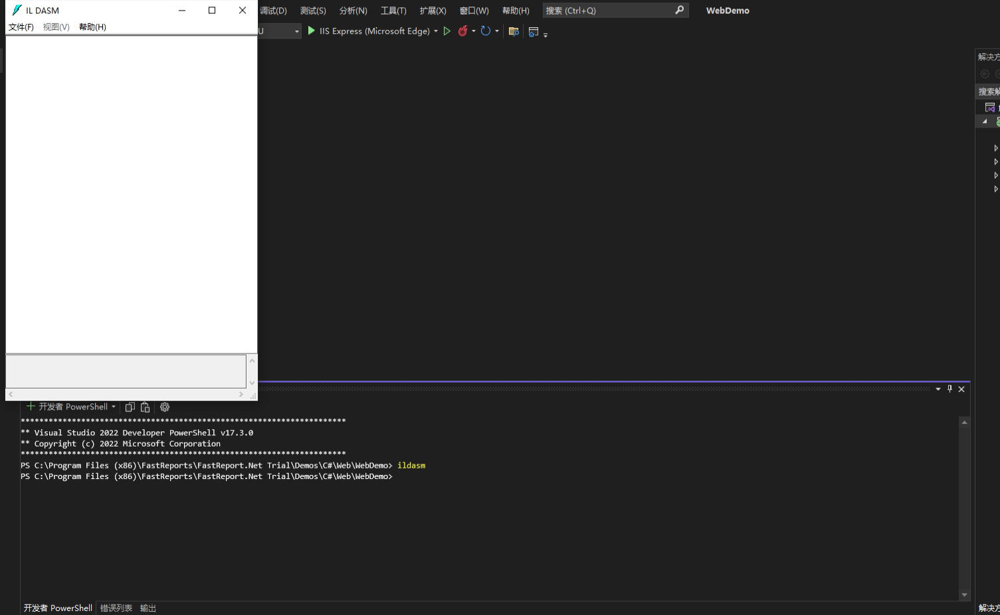

## FastReport 逆向工程处理打印5页限制及水印

### 一、需要提前准备的工作
1. 工具
    
    a) ILSpy 或者 Reflector

    b) ildasm（伴随 visual studion 安装）

2. 具备一定的逆向工程知识

### 二、原理

    使用 ildasm 将 dll 反编译成 il 文件，修改 il 文件后重新编译成 dll。

### 三、操作步骤

1. 在 visual studio 中打开控制台，输入 ildasm 弹出 IL DASM 界面



2. 打开 FastReport.dll 文件


3. 选择转储，保存文件到一个新建目录（FastReport）中，名称输入 FastReport


### 四、修改 IL 代码

> 修改 FastReport.Export.ExportBase.GetPagesCount 方法以解除5页限制

> 修改 FastReport.Export.ExportBase.GetOverlayPage 方法以去除水印


将相应的 IL 代码复制到 FastReport.il 文件中进行替换（FastReport.il 可通过任意文本编辑器打开修改）


### 五、重新编译成 dll

``` shell
c:\windows\microsoft.net\framework\v4.0.30319\ilasm.exe /dll/resource=FastReport.res FastReport.il 
```