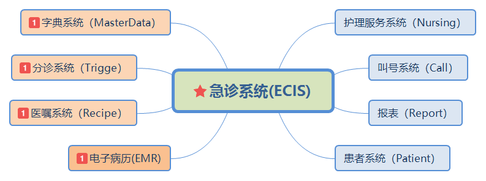
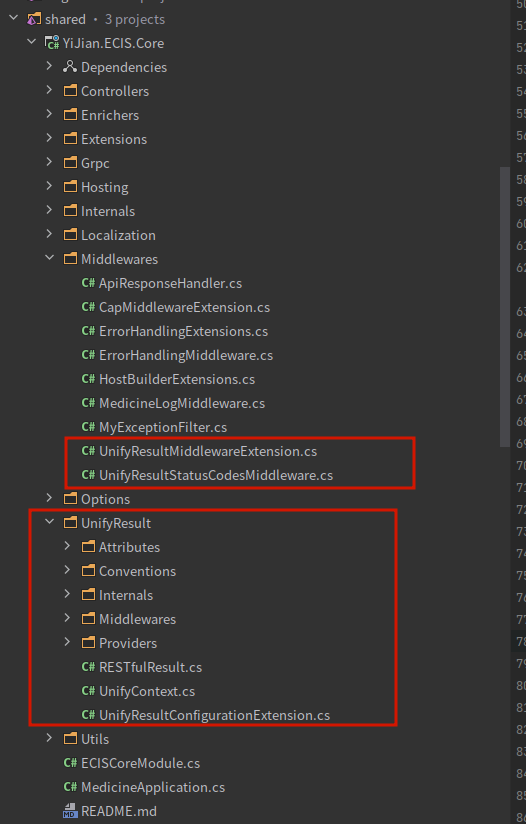

<div></img></div>
<h1 align="center">急诊系统</h2>

尚哲医键急诊系统采用微服务框架设计，除“预检分诊”在院前仓库外，其他微服务的代码均在当前仓库中。

### 一. 微服务的领域划分

微服务的划分如下：


### 二、如何使用ABP框架

### 三、DDD架构

### 四、EFCore **Code First** 如何管理迁移

### 五、如何使用缓存

### 六、如何使用统一返回中间件

> 因ABP框架 DynamicController 的一些特殊化处理，此处的统一返回中间件做了一些特殊处理，只适配 ABP 框架，不适配ASP.NET的默认 Controller 返回。

* AddUnifyResult 会为项目中所有的动态控制器的返回添加一层外部包装
* AddErrorUnifyResult 只会对错误返回做统一处理，200 OK 的接口返回不做处理，按原样返回。

其返回结果类似：

```json
{
  "code": 0,
  "data": {},
  "success": true,
  "message": "string",
  "timestamp": 0
}
```

其中 success 表示是否成功，code =200，data 属性为原动态控制器方法返回的结果。message 用于 success=false 时的返回信息。

1. 统一返回中间件的相关代码
   
    [UnifyResultMiddlewareExtension](shared/YiJian.ECIS.Core/Middlewares/UnifyResultMiddlewareExtension.cs)
   
    [UnifyResultStatusCodesMiddleware](shared/YiJian.ECIS.Core/Middlewares/UnifyResultStatusCodesMiddleware.cs)
   
    相关实现代码: shared/YiJian.ECIS.Core/UnifyResult/*
   
    

2. 如何使用
   
   1) 在 ConfigureServices 中调用
      
      ```csharp
      // 统一返回配置
      context.AddUnifyResult<RESTfulUnifyResultProvider>(); 
      ```
   
   2) 在 OnApplicationInitialization 中调用
      
      ```csharp
      // 使用统一返回中间件
      app.UseUnifyResultStatusCodes();
      ```
   
   3) 指定方法不使用统一返回
      
      引用中间件之后，所有的接口返回默认都会添加统一返回外层包装，若部分方法不需要走统一返回逻辑，可以添加 [NonUnify] 标签（可添加在控制器类或方法头部）。
      
      * 控制器如：
        
        ```csharp
        [NonUnify]
        public partial class NursingCanulaAppService : NursingAppService, INursingCanulaAppService
        {
        }
        ```
      
      * 方法如：
        
        ```csharp
        [NonUnify]
        [HttpGet("/api/ecis/recipe/documents/test")]
        public async Task<DocumentResponseDto> GetTestAsync(Guid piid)
        {
        }
        ```
      4) 统一返回的错误返回处理
         
         > 建议使用 Oh.Error() 方法抛出错误返回，可以在方法的任何地方调用 Oh.Error() 抛出异常进行友好异常返回，如：
      
      ```csharp
      public async Task UpdateAsync(BaseConfigUpdate input)
      {
         Oh.Error("时间格式不正确");
      }
      ```
      
      默认友好异常返回的格式如下：
      
      ```csharp
      {
      "code": 403,
      "success": false,
      "message": "时间格式不正确",
      "timestamp": 1658390984
      }
      ```

3. 如何定制统一返回格式
   
   可通过实现 IUnifyResultProvider 接口实现定制化的统一返回格式。

### 七、如何使用消息队列

1. CAP

2. 分布式领域事件

### 八、微服务间如何进行通讯

1. HTTP

2. gRPC

3. MQ

### 九、功能模块详细说明

* [医嘱套餐](doc/modules/RecipePackage.md)